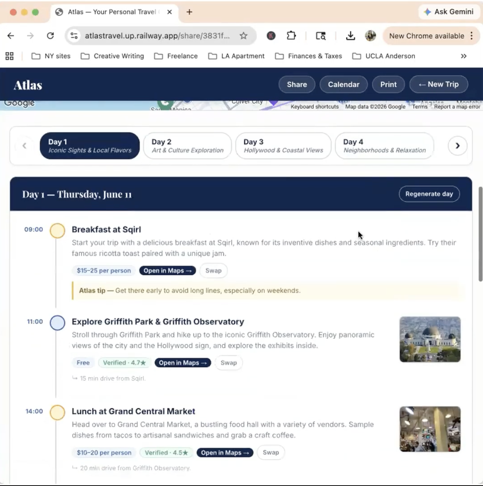
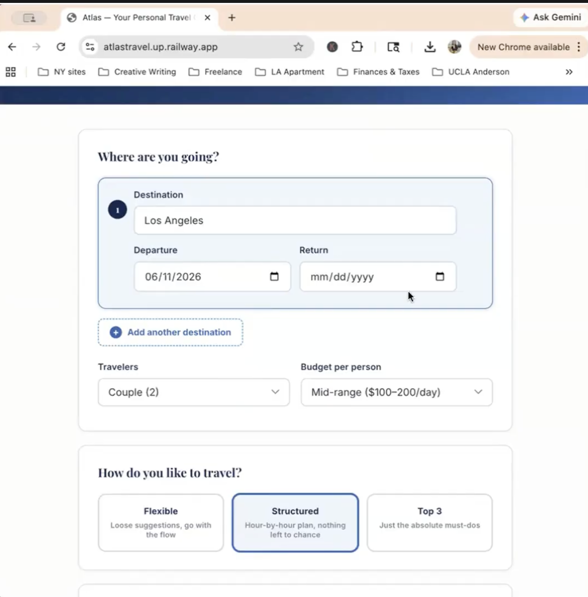

# Atlas ✈️

AI-powered travel concierge that generates personalized day-by-day itineraries with interactive maps, hotel picks, budget breakdowns, and calendar export.

Built as a final project for *The Science and Strategy of Artificial Intelligence*, part of the MBA curriculum at UCLA Anderson. 





---

## What it does

You enter your destination, travel dates, group size, budget, and interests — Atlas generates a complete trip plan in seconds. It supports single-destination and multi-city trips.

**Key features:**
- Day-by-day itinerary with activities, timing, and travel notes between stops
- Interactive map with pinned locations for every activity
- Hotel recommendations, transport overview, and full budget breakdown
- Swap or Regenerate individual activities/days without redoing the whole trip
- Pre-trip action checklist (flights to book, reservations to make, documents to check)
- Save trips, share via link, export to calendar (.ics), and print layout

## Tech stack

- **Backend:** Node.js + Express
- **AI:** OpenAI API (`gpt-4o-mini`) — core itinerary and supporting details generated in parallel to minimize load time
- **Maps:** Google Maps API + Google Places for location validation and activity enrichment
- **Database:** PostgreSQL (Railway) for saved trips and share links
- **Frontend:** Vanilla JS, HTML, CSS

## Architecture highlights

- Itinerary generation is split into two parallel API calls — one for the day-by-day schedule, one for hotels/transport/budget — so the map and days render immediately while the sidebar loads
- Input validation and sanitization on all fields before any model call
- Two-tier rate limiting (burst + daily) per IP to protect API costs
- Request ID middleware for end-to-end log tracing
- Graceful degradation — the app runs fully without a database (save/share features return a 503 with a clear message)

## Running locally

1. Clone the repo
2. Install dependencies:
   ```bash
   npm install
   ```
3. Create a `local.env` file in the project root:
   ```
   OPENAI_API_KEY=your_openai_key
   OPENAI_MODEL=gpt-4o-mini
   GOOGLE_MAPS_KEY=your_google_maps_key
   DATABASE_URL=your_postgres_url   # optional — save/share features only
   ```
4. Start the server:
   ```bash
   npm start
   ```
5. Open `http://localhost:3000`

## Deployment

Deployed on [Railway](https://railway.app). Set the same environment variables from `local.env` in your Railway service settings. Railway's Postgres add-on injects `DATABASE_URL` automatically when connected.
